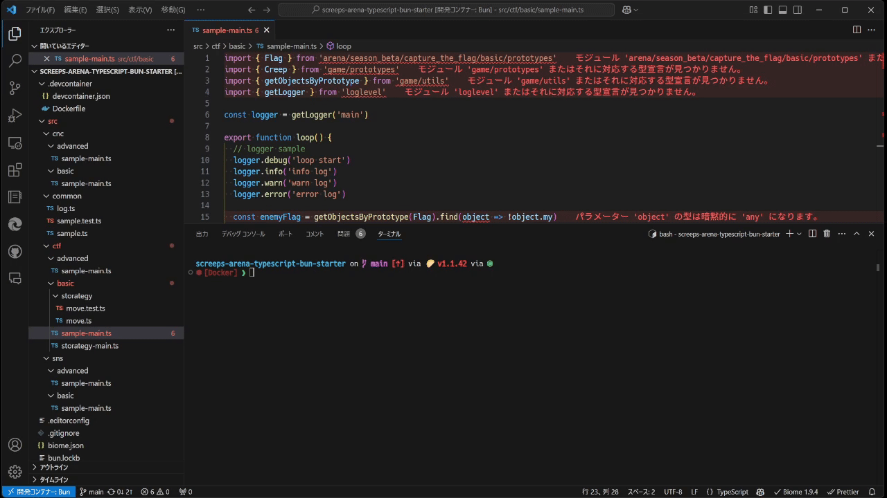

# Screeps Arena TypeScript Starter with bun

This repo is unofficial starter template.

This repo uses devcontainers. you can use bun without any installation external tools.

To install dependencies:

```bash
bun install
```

To build:

```bash
bun run build
```

or watch changes:

```bash
bun run build:watch
```

To lint:

```bash
bun lint
```

To test:

```bash
bun test
```

To format:

```bash
bun fmt
```

To check by formatter, linter, import sorter

```bash
bun check
```

run your bot with Screeps arena: use dist/ctf/basic/sample-main (or other) directory.

This project was created using `bun init` in bun v1.0.20. [Bun](https://bun.sh) is a fast all-in-one JavaScript runtime.

## demo


